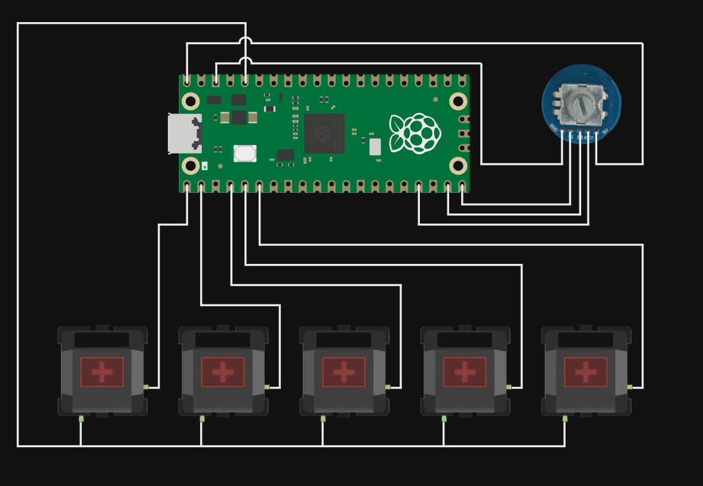

# Pico Macropad

### Hardware
- Pi pico
- EC11 rotary encoder module
- 5 mx keys
- wire

### Diagram


### Code
```
"""
Pi pico rotary encoder volume control with click support and 5 programmable keys
"""
import board #importing board module
import time #importing time module
import digitalio #importing digitalio module
import usb_hid #importing USB hid module for keyboard behavior
from adafruit_hid.keycode import Keycode #importing Keycode module
from adafruit_hid.keyboard import Keyboard #importing Keyboard module
from adafruit_hid.mouse import Mouse #importing Mouse module
from adafruit_hid.consumer_control import ConsumerControl
from adafruit_hid.consumer_control_code import ConsumerControlCode

led = digitalio.DigitalInOut(board.LED)
led.direction = digitalio.Direction.OUTPUT
led.value = True

#This is where we list the pins for the key switches
btn1_pin = board.GP0
btn2_pin = board.GP1
btn3_pin = board.GP2
btn4_pin = board.GP3
btn5_pin = board.GP4

#This is where we activate switches and set pull downs/directions for each pin
btn1 = digitalio.DigitalInOut(btn1_pin)
btn1.direction = digitalio.Direction.INPUT
btn1.pull = digitalio.Pull.DOWN

btn2 = digitalio.DigitalInOut(btn2_pin)
btn2.direction = digitalio.Direction.INPUT
btn2.pull = digitalio.Pull.DOWN

btn3 = digitalio.DigitalInOut(btn3_pin)
btn3.direction = digitalio.Direction.INPUT
btn3.pull = digitalio.Pull.DOWN

btn4 = digitalio.DigitalInOut(btn4_pin)
btn4.direction = digitalio.Direction.INPUT
btn4.pull = digitalio.Pull.DOWN

btn5 = digitalio.DigitalInOut(btn5_pin)
btn5.direction = digitalio.Direction.INPUT
btn5.pull = digitalio.Pull.DOWN

#This is where we define the pins for the rotary encoder
CLK_PIN = board.GP14
DT_PIN = board.GP15
SW_PIN = board.GP13 
clk_last = None
sw_last = None
#totalMode = 3
currentMode = 2

#This is where we create variables to interact with usb_hid.devices
cc = ConsumerControl(usb_hid.devices)
mouse = Mouse(usb_hid.devices)
keyboard = Keyboard(usb_hid.devices)

#This is where we create variables to listen to the rotary encoder's direction
clk = digitalio.DigitalInOut(CLK_PIN)
clk.direction = digitalio.Direction.INPUT

dt = digitalio.DigitalInOut(DT_PIN)
dt.direction = digitalio.Direction.INPUT

#This is where we create variables to listen to the rotary encoder's button press
sw = digitalio.DigitalInOut(SW_PIN)
sw.direction = digitalio.Direction.INPUT
sw.pull = digitalio.Pull.UP

#These are the functions for bringing volume up, down, and muting the sound
def ccw():
    print("CCW")

    if(currentMode == 2):   # Volume decrement
        cc.send(ConsumerControlCode.VOLUME_DECREMENT)

def cw():
    print("CW")
    if(currentMode == 2):     # Volume increment
        cc.send(ConsumerControlCode.VOLUME_INCREMENT)
        
def mute():
    print("Mute")
    cc.send(ConsumerControlCode.MUTE)


#This is where we define what keyboard stands for
keyboard = Keyboard(usb_hid.devices)

#This is where the fun begins!
while True: #setting up infinite loop
    
    clkState = clk.value
    if(clk_last != clkState):
        if(dt.value != clkState):
            cw()
        else:
            ccw()
            
    clk_last = clkState
    
    swState = sw.value
    if sw_last != swState: #if button 1 pressed
        mute() #sending out code for 1
        time.sleep(0.2) #sleep for a spell
    sw_last = sw.value
    
    #This is where we tie the switch presses to keycodes from the Keycode module
    if btn1.value: #if button 1 pressed
        keyboard.send(Keycode.CONTROL, Keycode.C) #sending out code for 1
        time.sleep(0.2) #sleep for a spell

    if btn2.value: #if button 2 pressed
        keyboard.send(Keycode.CONTROL, Keycode.V) #sending out code for 1
        time.sleep(0.2) #sleep for a spell
        
    if btn3.value: #if button 3 pressed
        cc.send(ConsumerControlCode.PLAY_PAUSE) #sending out code for 1
        time.sleep(0.2) #sleep for a spell
        
    if btn4.value: #if button 4 pressed
        cc.send(ConsumerControlCode.SCAN_PREVIOUS_TRACK) #sending out code for 1
        time.sleep(0.2) #sleep for a spell

    if btn5.value: #if button 5 pressed
        cc.send(ConsumerControlCode.SCAN_NEXT_TRACK) #sending out code for 1
        time.sleep(0.2) #sleep for a spell

```
